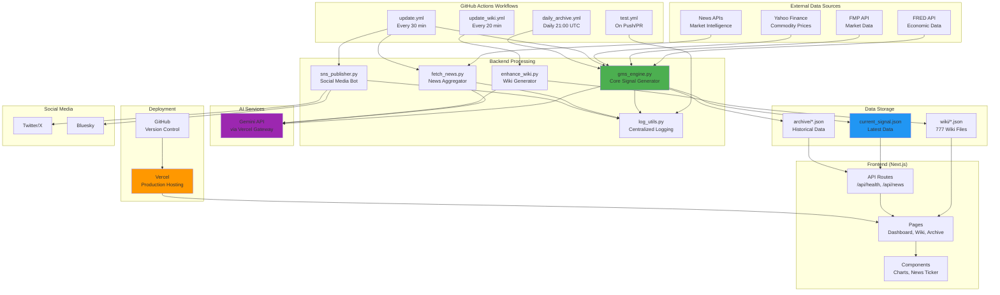
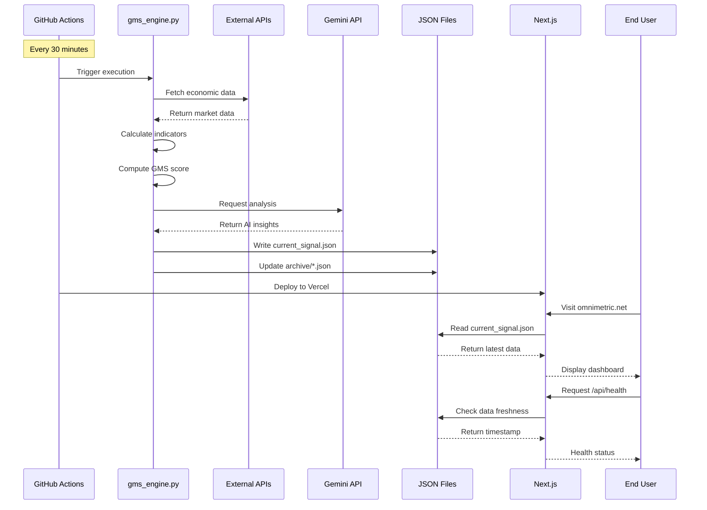
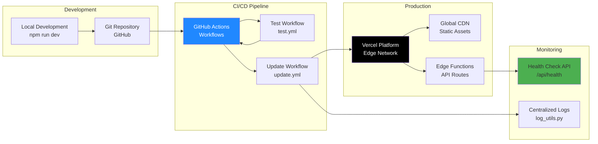
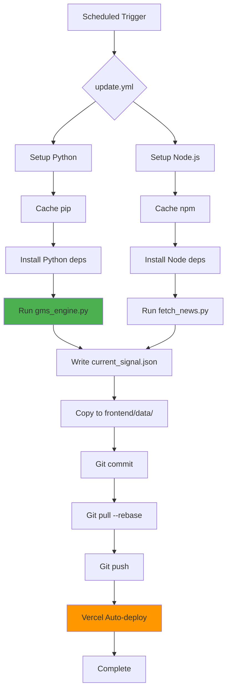
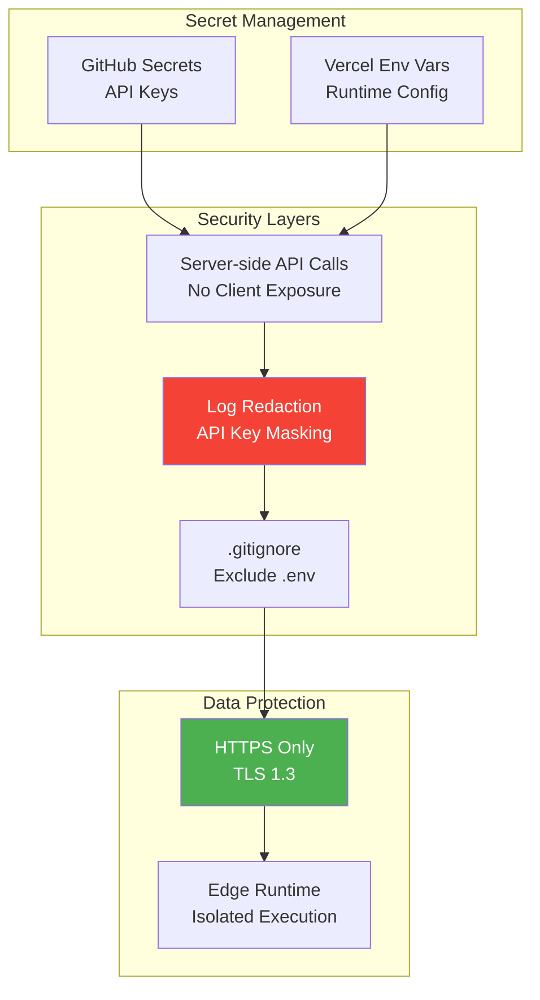

# Architecture Documentation

## Overview

This document provides a comprehensive overview of the Global Macro Signal (GMS) system architecture, including system components, data flows, and deployment infrastructure.

---

## System Architecture

---

## Data Flow Diagram

---

## Deployment Architecture

---

## Component Breakdown

### Backend Components

| Component | Purpose | Frequency |
|-----------|---------|-----------|
| `gms_engine.py` | Core signal generation | Every 30 min |
| `fetch_news.py` | News aggregation & translation | Every 30 min |
| `sns_publisher.py` | Social media posting | Every 30 min |
| `enhance_wiki.py` | Wiki content generation | Every 20 min |
| `log_utils.py` | Centralized logging | On-demand |

### Frontend Components

| Component | Purpose | Type |
|-----------|---------|------|
| Dashboard | Main GMS display | Page |
| Wiki | Educational content | Page |
| Archive | Historical data | Page |
| `/api/health` | System monitoring | API Route |
| `/api/news` | News endpoint | API Route |

### External Dependencies

| Service | Purpose | Criticality |
|---------|---------|-------------|
| FRED API | Economic indicators | **Critical** |
| FMP API | Market data | **Critical** |
| Gemini API | AI analysis | **Critical** |
| Yahoo Finance | Commodity prices | High |
| Twitter API | Social posting | Medium |
| Bluesky API | Social posting | Medium |

---

## Workflow Orchestration

---

## Security Architecture

---

## Scaling Considerations

### Current Capacity

- **Update Frequency**: Every 30 minutes
- **Wiki Generation**: Every 20 minutes (777 files total)
- **Concurrent Users**: Unlimited (Vercel Edge CDN)
- **Data Storage**: JSON files (lightweight, fast)

### Bottlenecks

1. **API Rate Limits**: FRED, FMP, Gemini quotas
2. **Workflow Execution Time**: ~5-7 minutes per run
3. **Wiki Generation**: ~40 hours total (accelerated to ~13 hours)

### Future Optimizations

- Database migration for historical data
- Caching layer for API responses
- Parallel wiki generation
- WebSocket for real-time updates

---

## Disaster Recovery

### Backup Strategy

- **Git History**: Full version control
- **Archive Files**: Daily snapshots in `archive/*.json`
- **Git Tags**: Stable releases (e.g., `V4.7-STABLE`)

### Recovery Procedures

1. **Data Loss**: Restore from `archive/*.json` or Git history
2. **Workflow Failure**: Check logs, rerun manually
3. **API Outage**: Fallback to cached data
4. **Deployment Issue**: Rollback to previous Git tag

---

## Monitoring & Observability

### Health Monitoring

- **Endpoint**: `/api/health`
- **Metrics**: Data age, GMS score, system status
- **Alerts**: `healthy`, `warning`, `critical`, `error`

### Logging

- **Centralized**: `log_utils.py`
- **Formats**: Text (default), JSON (optional)
- **Rotation**: 10MB max, 5 backups
- **Redaction**: Automatic API key masking

### GitHub Actions Logs

- Workflow execution history
- Step-by-step output
- Error traces and debugging

---

## Technology Stack

### Backend

- **Language**: Python 3.11
- **Key Libraries**: `requests`, `pandas`, `python-dotenv`
- **AI**: Gemini API (via Vercel AI Gateway)

### Frontend

- **Framework**: Next.js 16.1.1 (App Router)
- **Runtime**: Vercel Edge
- **Styling**: Vanilla CSS
- **Charts**: Recharts

### Infrastructure

- **Hosting**: Vercel
- **CI/CD**: GitHub Actions
- **Version Control**: Git/GitHub
- **CDN**: Vercel Edge Network

---

## Related Documentation

- [Environment Variables](./ENVIRONMENT_VARIABLES.md)
- [Health Check API](./HEALTH_CHECK_API.md)
- [Testing Guide](./TESTING.md)
- [Project Specification](../PROJECT_SPEC.md)
